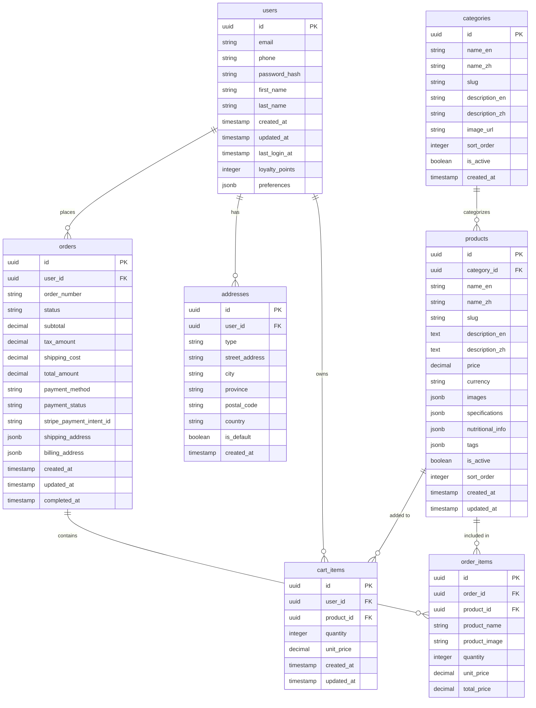

# Data Model: Juewei E-commerce Platform

**Date**: 2024-12-19  
**Feature**: Juewei E-commerce Platform  
**Database**: Supabase PostgreSQL

## Entity Relationships



## Entity Definitions

### Users Table
**Purpose**: Store user account information and authentication data

**Fields**:
- `id` (uuid, PK): Unique user identifier
- `email` (string, unique): User email address
- `phone` (string, unique): User phone number
- `password_hash` (string): Encrypted password
- `first_name` (string): User's first name
- `last_name` (string): User's last name
- `created_at` (timestamp): Account creation time
- `updated_at` (timestamp): Last profile update time
- `last_login_at` (timestamp): Last login time
- `loyalty_points` (integer): User loyalty points
- `preferences` (jsonb): User preferences and settings

**Validation Rules**:
- Email must be valid format
- Phone must be valid format
- Password must meet security requirements
- Names cannot be empty

### Addresses Table
**Purpose**: Store user shipping and billing addresses

**Fields**:
- `id` (uuid, PK): Unique address identifier
- `user_id` (uuid, FK): Reference to users table
- `type` (string): Address type (shipping, billing)
- `street_address` (string): Street address
- `city` (string): City name
- `province` (string): Province/state
- `postal_code` (string): Postal/ZIP code
- `country` (string): Country code
- `is_default` (boolean): Default address flag
- `created_at` (timestamp): Creation time

**Validation Rules**:
- All address fields required
- Only one default address per type per user
- Country must be valid country code

### Categories Table
**Purpose**: Organize products into categories with multi-language support

**Fields**:
- `id` (uuid, PK): Unique category identifier
- `name_en` (string): English category name
- `name_zh` (string): Chinese category name
- `slug` (string, unique): URL-friendly identifier
- `description_en` (text): English description
- `description_zh` (text): Chinese description
- `image_url` (string): Category image
- `sort_order` (integer): Display order
- `is_active` (boolean): Active status
- `created_at` (timestamp): Creation time

**Validation Rules**:
- Names required in both languages
- Slug must be unique and URL-safe
- Sort order must be positive integer

### Products Table
**Purpose**: Store product information with multi-language support

**Fields**:
- `id` (uuid, PK): Unique product identifier
- `category_id` (uuid, FK): Reference to categories table
- `name_en` (string): English product name
- `name_zh` (string): Chinese product name
- `slug` (string, unique): URL-friendly identifier
- `description_en` (text): English description
- `description_zh` (text): Chinese description
- `price` (decimal): Product price
- `currency` (string): Currency code (USD, CNY)
- `images` (jsonb): Array of image URLs
- `specifications` (jsonb): Product specifications
- `nutritional_info` (jsonb): Nutritional information
- `tags` (jsonb): Product tags for search
- `is_active` (boolean): Active status
- `sort_order` (integer): Display order
- `created_at` (timestamp): Creation time
- `updated_at` (timestamp): Last update time

**Validation Rules**:
- Names required in both languages
- Price must be positive
- Currency must be valid code
- Slug must be unique and URL-safe

### Cart Items Table
**Purpose**: Store user shopping cart items

**Fields**:
- `id` (uuid, PK): Unique cart item identifier
- `user_id` (uuid, FK): Reference to users table
- `product_id` (uuid, FK): Reference to products table
- `quantity` (integer): Item quantity
- `unit_price` (decimal): Price per unit
- `created_at` (timestamp): Addition time
- `updated_at` (timestamp): Last update time

**Validation Rules**:
- Quantity must be positive
- Unit price must match current product price
- User can only have one cart item per product

### Orders Table
**Purpose**: Store order information and payment details

**Fields**:
- `id` (uuid, PK): Unique order identifier
- `user_id` (uuid, FK): Reference to users table
- `order_number` (string, unique): Human-readable order number
- `status` (string): Order status (ordered, processing, ready, completed)
- `subtotal` (decimal): Subtotal before tax and shipping
- `tax_amount` (decimal): Tax amount
- `shipping_cost` (decimal): Shipping cost
- `total_amount` (decimal): Final total amount
- `payment_method` (string): Payment method (stripe, cash)
- `payment_status` (string): Payment status
- `stripe_payment_intent_id` (string): Stripe payment intent ID
- `shipping_address` (jsonb): Shipping address
- `billing_address` (jsonb): Billing address
- `created_at` (timestamp): Order creation time
- `updated_at` (timestamp): Last update time
- `completed_at` (timestamp): Order completion time

**Validation Rules**:
- Order number must be unique
- Status must be valid enum value
- All amounts must be non-negative
- Payment method must be valid

### Order Items Table
**Purpose**: Store individual items within orders

**Fields**:
- `id` (uuid, PK): Unique order item identifier
- `order_id` (uuid, FK): Reference to orders table
- `product_id` (uuid, FK): Reference to products table
- `product_name` (string): Product name at time of order
- `product_image` (string): Product image at time of order
- `quantity` (integer): Item quantity
- `unit_price` (decimal): Price per unit at time of order
- `total_price` (decimal): Total price for this item

**Validation Rules**:
- Quantity must be positive
- All prices must be non-negative
- Product name and image required for historical accuracy

## State Transitions

### Order Status Flow
```
Ordered → Processing → Ready → Completed
```

**Ordered**: Order created, payment pending
**Processing**: Payment confirmed, order being prepared
**Ready**: Order ready for pickup
**Completed**: Order picked up or delivered

### Payment Status Flow
```
pending → processing → succeeded → completed
```

**pending**: Payment initiated
**processing**: Payment being processed
**succeeded**: Payment successful
**completed**: Payment fully processed

## Indexes and Performance

### Primary Indexes
- `users.email` (unique)
- `users.phone` (unique)
- `products.slug` (unique)
- `categories.slug` (unique)
- `orders.order_number` (unique)

### Performance Indexes
- `orders.user_id` (for user order history)
- `orders.status` (for order filtering)
- `products.category_id` (for category browsing)
- `products.is_active` (for active products)
- `cart_items.user_id` (for user cart)

### Full-Text Search Indexes
- `products.name_en` (English search)
- `products.name_zh` (Chinese search)
- `products.tags` (tag-based search)

## Data Validation Rules

### User Data
- Email format validation
- Phone number format validation
- Password strength requirements
- Name length limits

### Product Data
- Price validation (positive numbers)
- Image URL validation
- Slug format validation
- Multi-language content requirements

### Order Data
- Order number uniqueness
- Status enum validation
- Amount calculations
- Address format validation

## Security Considerations

### Row Level Security (RLS)
- Users can only access their own data
- Admins can access all data
- Public access only for active products
- Cart items restricted to owner

### Data Encryption
- Sensitive user data encrypted
- Payment information never stored
- Address data encrypted at rest
- Audit trail for all changes

## Backup and Recovery

### Backup Strategy
- Daily automated backups
- Point-in-time recovery
- Cross-region replication
- Encrypted backup storage

### Recovery Procedures
- Database restoration process
- Data integrity verification
- User notification system
- Rollback procedures
